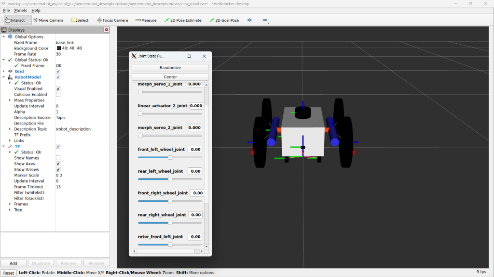
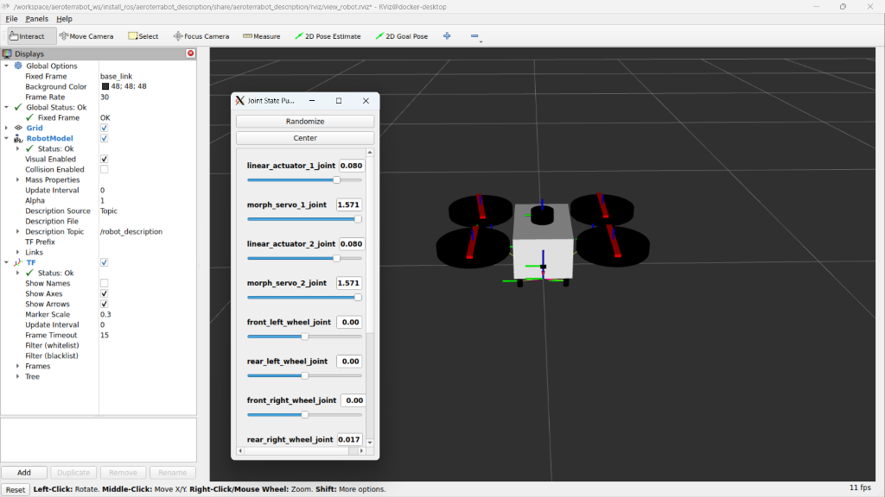
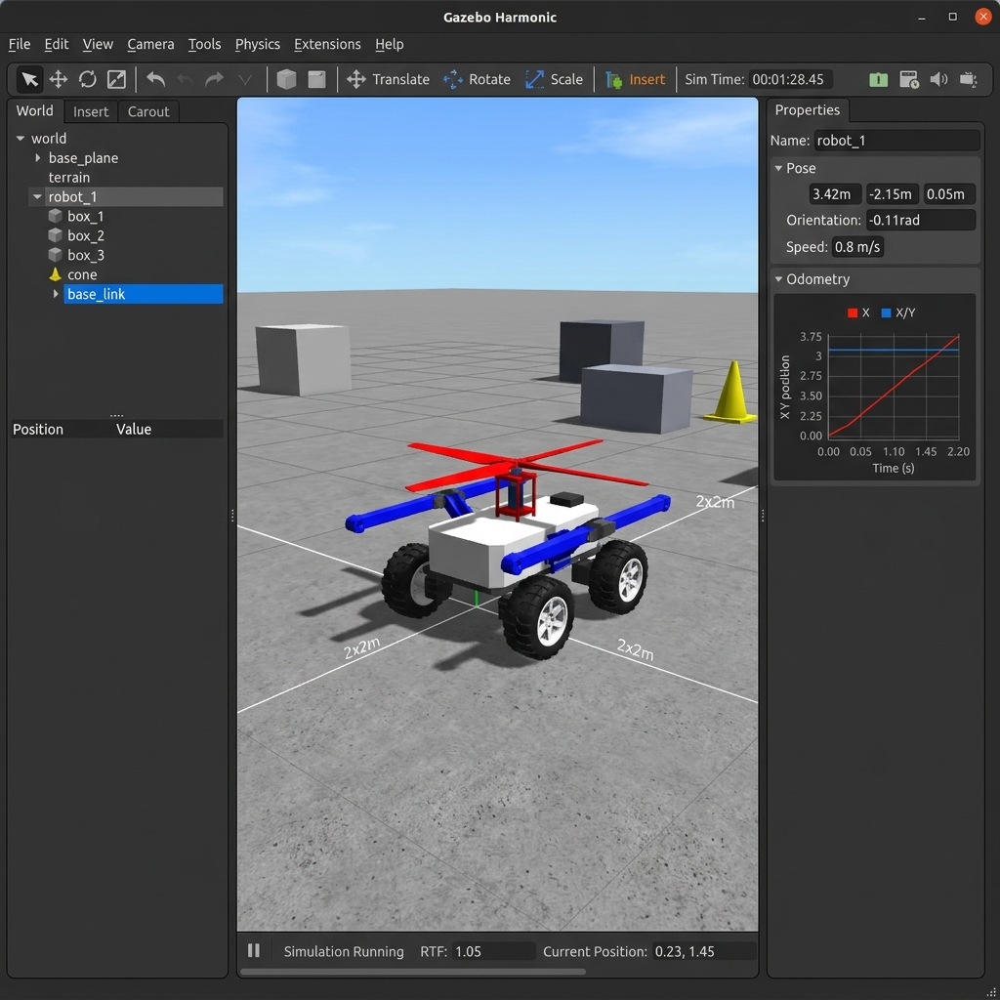

# AeroTerrainBot: Hybrid Morphing Robotics Platform 🚁🚜

[](https://docs.ros.org/en/jazzy/index.html)
[](https://gazebosim.org/home)
[](https://www.docker.com/)

AeroTerrainBot is an advanced robotics research project focusing on **Multi-Modal Mobility**. Inspired by the M4 (Multi-Modal Mobility Morphobot), this platform seamlessly transforms between an **All-Terrain Wheeled Vehicle (Tank Mode)** and a **Quadrotor Drone (Flight Mode)**.

Designed for high-versatility missions, it solves the "last-mile" problem in complex environments where traditional ground or aerial robots alone would fail.

---

## 🌟 Key Capabilities & Features

*   **Kinematic Transformation**: Utilizes high-torque servos and linear actuators to reconfigure the chassis geometry in real-time.
*   **Dual-Mode Propulsion**: 
    *   **Ground**: 4x Skid-Steer Omni-wheels driven by independent velocity controllers.
    *   **Aerial**: 4x Internal brushless rotors exposed by rotating the wheel-booms 90° vertically.
*   **Physics-Centric Simulation**: Full simulation in **Gazebo Harmonic**, featuring contact-friction dynamics, IMU, Lidar, and Camera sensor integration.
*   **Modular ros2_control Framework**: A sophisticated hardware abstraction layer that allows the exact same control logic to run in simulation (`GazeboSimSystem`) and on physical hardware (`Teensy 4.0`).

---

## 📸 System Visualisation

### Morphing Logic (RViz)
| **Ground Drive (Tank Mode)** | **Aerial Propulsion (Flight Mode)** |
| :---: | :---: |
|  |  |
| *Wheels down, booms horizontal for ground traversal.* | *Booms rotated 90° up; wheels serve as prop-guards.* |

### Simulation Environment (Gazebo Harmonic)

*Robotic state validation and sensor feedback integration in the Gazebo Sim physics environment.*

---

## 🛠️ Technical Architecture

### Tech Stack
*   **Middleware**: ROS 2 Jazzy Jalisco (Ubuntu 24.04)
*   **Simulator**: Gazebo Harmonic (GZ Sim)
*   **Control**: `ros2_control`, `joint_state_broadcaster`, `diff_drive_controller`
*   **Modelling**: XACRO / URDF with nested macros for modular boom/wheel assemblies
*   **DevOps**: Docker, Docker Compose for reproducible builds

### Control System Logic
The architecture utilizes a centralized `controller_manager` to orchestrate three specialized controllers:
1.  **Tank Drive Controller**: A `diff_drive_controller` variant for skid-steer ground movement.
2.  **Morph Controller**: A `joint_trajectory_controller` managing the 2 servos and 2 linear actuators for state transitions.
3.  **Rotor Controller**: A `velocity_controller` group for independent rotor RPM management during flight.

---

## 🚀 Getting Started (Simulation)

This repository is fully containerized for easy setup.

### 1. Prerequisites
- [Docker](https://www.docker.com/) & [Docker Compose](https://docs.docker.com/compose/)
- [VcXsrv / XLaunch](https://sourceforge.net/projects/vcxsrv/) (For Windows users to view the GUI)

### 2. Launch Environment
```bash
# Start the container
docker compose up -d

# Build the workspace (inside the container)
docker exec -it aeroterrabot-aeroterrabot_dev-1 bash -c "source /opt/ros/jazzy/setup.bash && cd /workspace/aeroterrabot_ws && colcon build --symlink-install"
```

### 3. Run Simulation
Launch the Gazebo world, robot spawner, and ROS-GZ bridge:
```bash
docker exec -it aeroterrabot-aeroterrabot_dev-1 bash -c "source /opt/ros/jazzy/setup.bash && source /workspace/aeroterrabot_ws/install_ros/setup.bash && ros2 launch aeroterrabot_gazebo gazebo.launch.py"
```

### 4. Teleoperation
Drive the robot using your keyboard:
```bash
docker exec -it aeroterrabot-aeroterrabot_dev-1 bash -c "source /opt/ros/jazzy/setup.bash && ros2 run teleop_twist_keyboard teleop_twist_keyboard --ros-args --remap cmd_vel:=/tank_drive_controller/cmd_vel"
```

---

## 📐 Engineering Challenges Solved

*   **Simulator Synchronization**: Resolved clock-desynchronization issues between the ROS 2 node and the Gazebo physics engine by implementing synchronized `use_sim_time` parameters.
*   **Hardware Abstraction**: Designed a unified URDF that dynamically toggles between serial-based hardware interfaces and Gazebo system plugins based on launch arguments.
*   **Physics Tuning**: Optimized friction coefficients and chassis weight distribution to prevent high-centering during high-speed ground maneuvers.

---

## 📈 Future Roadmap
- [ ] **Autonomous Navigation**: Integrating Nav2 stack for SLAM-based path planning.
- [ ] **Flight Controller Integration**: Implementation of PX4/ArduPilot SITL for aerial stability.
- [ ] **Computer Vision**: Deployment of YOLOv8 nodes for obstacle detection via the onboard simulated camera.

## 🤝 Contact & Contributions
Developed by **Mohammed Faraz**. 
Building the future of hybrid mobility.
